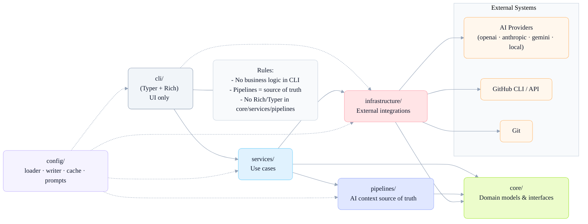
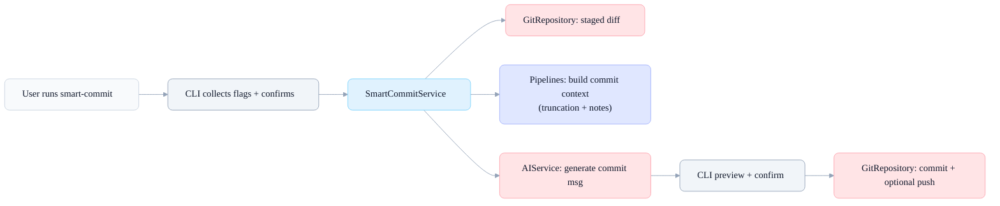
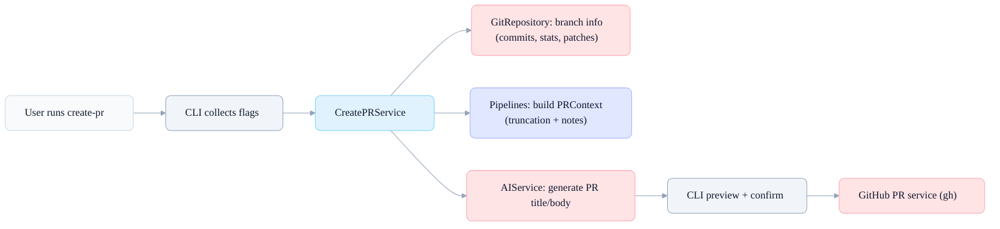
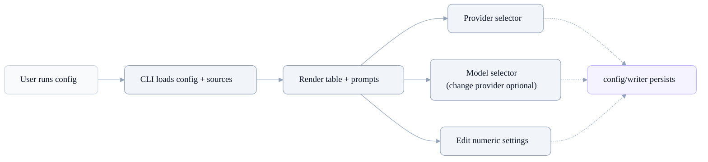
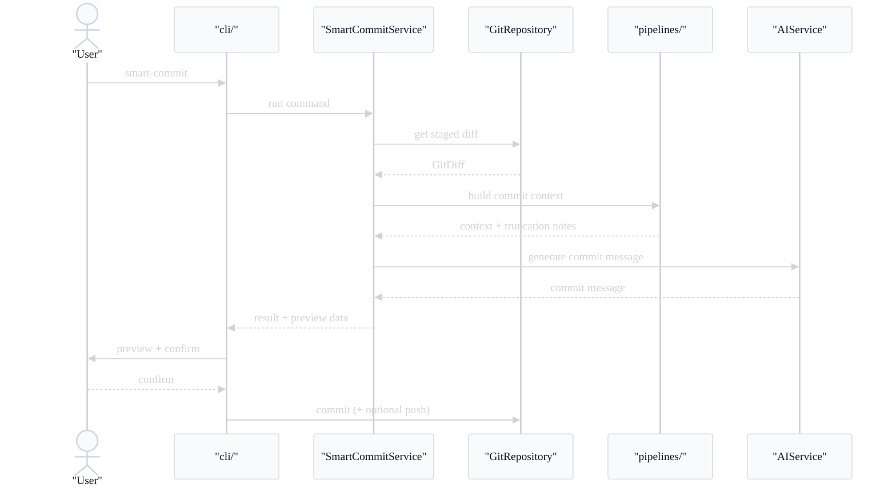
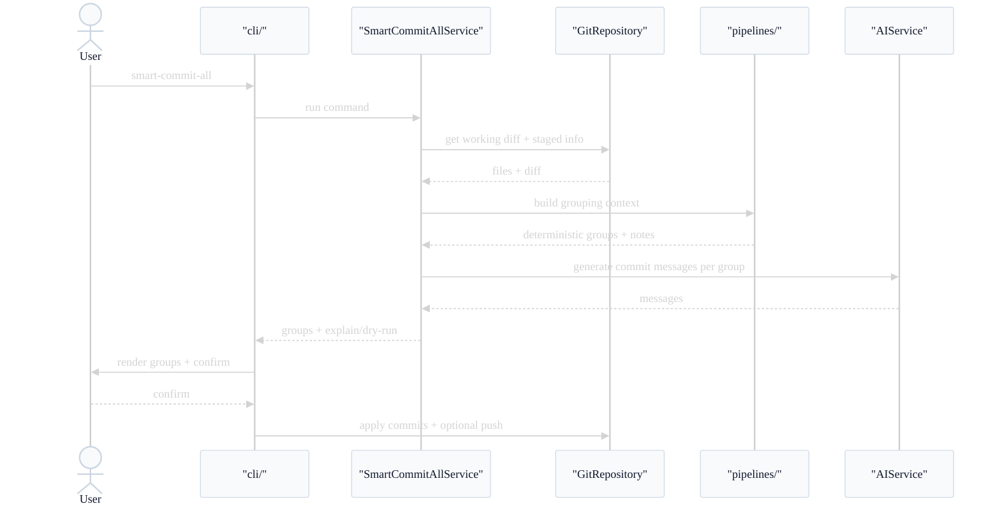

# Diagrams: Architecture and Workflows

This document provides Mermaid diagrams for architecture and CLI workflows.

## Architecture Overview (Layers and Dependencies)

## High-Level Workflows (per command)

### smart-commit

### smart-commit-all

### create-pr

### config (provider/model/settings)

## Detailed Sequence: smart-commit

## Detailed Sequence: smart-commit-all

